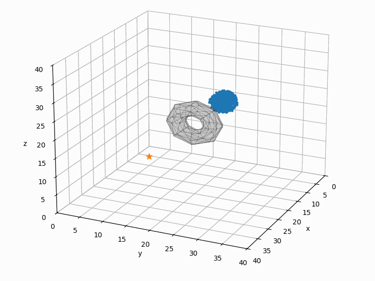
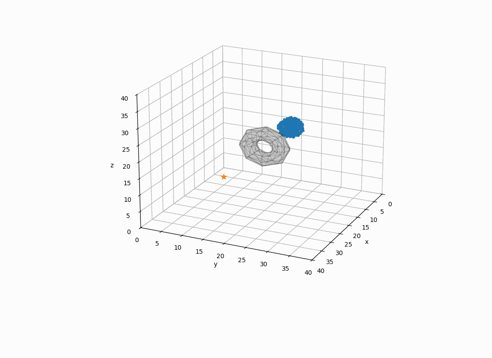

🐟 Swarm Control with RL & Expert Blending inspired by Reynolds Movel
============================================================

Interactive and reinforcement-learning-based control of a 3D
fish swarm in obstacle-filled environments.

------------------------------------------------------------
📌 Overview
------------------------------------------------------------

This repository contains a simulation and control framework
for a swarm of fish-like agents navigating in 3D environments.

Two complementary control modes are supported:

1) Interactive Control
   - Expert blending via polygon UI

2) Learned Control
   - Expert behaviors trained via Monte Carlo search
   - PPO policy learns how to blend experts
   - Optional learned intermediate goal (relative to swarm)

Main challenge addressed:
→ Navigation in obstacle-rich environments
→ Avoiding situations where the swarm gets stuck

<table>
  <tr>
    <td align="center">
       
      Manual Parameter Tuning
    </td>
    <td align="center">
       
      Goal Optimized Expert Tuning
    </td>
  </tr>
</table>

<table>
  <tr>
    <td align="center">
       
      Grouped Exploration Optimized Expert Tuning
    </td>
    <td align="center">
       
      Maximum Exploration Optimized Expert Tuning
    </td>
  </tr>
</table>

<table>
  <tr>
    <td align="center">
       
      PPO Final Training: Large Wall
    </td>
    <td align="center">
       
      PPO Final Training: Large Wall Side View
    </td>
  </tr>
</table>

<table>
  <tr>
    <td align="center">
       
      PPO Test: 3 Large Walls
    </td>
    <td align="center">
       
      PPO Test: 3 Large Walls Side View
    </td>
  </tr>
</table>

------------------------------------------------------------
🧠 Main Ideas
------------------------------------------------------------

The system combines three layers:

1) Swarm Simulator
   - 3D boid-based dynamics
   - Obstacle avoidance fields
   - Collision handling
   - Goal-driven motion
   - Visualization

2) Expert Behaviors
   Precomputed motion primitives:
   - Grouped / free-roam motion
   - Goal-directed motion
   - Exploration
   - (Optional) obstacle-aware variants

3) PPO Policy
   Learns how to blend experts

------------------------------------------------------------
📁 Repository Structure
------------------------------------------------------------

Env/
  env.py
    Core simulation:
    - boid dynamics
    - obstacle fields
    - goal handling
    - rollout logic

RL/
  ppo_agent.py
    PPO implementation (PyTorch)

  swarm_features.py
    Observation features:
    - cohesion, dispersion, alignment
    - goal distance & progress
    - exploration coverage
    - blocked fraction

  fish_wrapper.py
    RL interface:
    - expert blending
    - reward computation
    - intermediate goal decoding

train_expert_monte_carlo.py
  Offline expert optimization

train_ppo_blend.py
  PPO training

test_ppo_blend.py
  PPO evaluation + visualization

test_expert_monte_carlo.py
  Interactive demo

controllers/
  actionblender.py
  utils.py

save/
  Stored expert parameters (.pkl)

checkpoints/
  Saved PPO models (.pt)

------------------------------------------------------------
🎮 Control Modes
------------------------------------------------------------

1) Interactive Expert Blending

Run:
  python test_expert_monte_carlo.py

Features:
  - Polygon UI → barycentric expert blending
  - Real-time behavior mixing

---

1) PPO-Based Control

Run:
  python test_ppo_blend.py

The PPO policy outputs:
  - Expert blending weights

Goal:
  Reach the global target while adapting locally.

------------------------------------------------------------
🐟 Expert Behaviors
------------------------------------------------------------

Stored in:
  save/

Examples:
  - goal.pkl
  - random_exploration.pkl
  - grouped_exploration.pkl

Each expert is a parameter vector controlling:
  - separation
  - alignment
  - cohesion
  - obstacle avoidance
  - goal attraction
  - randomness
  - neighborhood radii

Train new experts:
  python train_expert_monte_carlo.py

------------------------------------------------------------
🤖 PPO Action Space
------------------------------------------------------------

Action dimension: 6

[a0, a1, a2]

First 3:
  → expert blending logits
  → softmax → weights

The wrapper converts this into:
  - normalized weights

------------------------------------------------------------
🎯 Reward Design
------------------------------------------------------------

Compact and interpretable:

+ Goal progress
+ Exploration (when stuck)
- Rapid switching between experts
+ Success bonus

Encourages:
  - forward motion
  - escaping local minima
  - smooth behavior transitions

------------------------------------------------------------
👁️ Observations (PPO)
------------------------------------------------------------

Feature vector includes:

- cohesion
- dispersion
- alignment
- explored workspace %
- goal distance
- goal progress
- blocked fraction

All features are normalized.

------------------------------------------------------------
🏋️ Training Workflow
------------------------------------------------------------

1) Train "Experts"
   python train_expert_monte_carlo.py

2) Train PPO Blending
   python train_ppo_blend.py

3) Evaluate PPO Blending
   python test_ppo_blend.py

4) Interactive demo for manual blending
   python test_expert_joystick.py

------------------------------------------------------------
⚙️ Requirements
------------------------------------------------------------

Core:
  - numpy
  - matplotlib
  - torch
  - gymnasium
  - numba

Install:
  pip install numpy matplotlib torch gymnasium numba

------------------------------------------------------------
📊 Typical Usage
------------------------------------------------------------

Train PPO:
  python train_ppo_blend.py

Test PPO:
  python test_ppo_blend.py

Interactive control:
  python test_expert_monte_carlo.py

------------------------------------------------------------
📄 License
------------------------------------------------------------

MIT License

------------------------------------------------------------
🙏 Acknowledgements
------------------------------------------------------------

- PPO inspired by standard RL baselines
- Swarm model based on Reynolds Boids